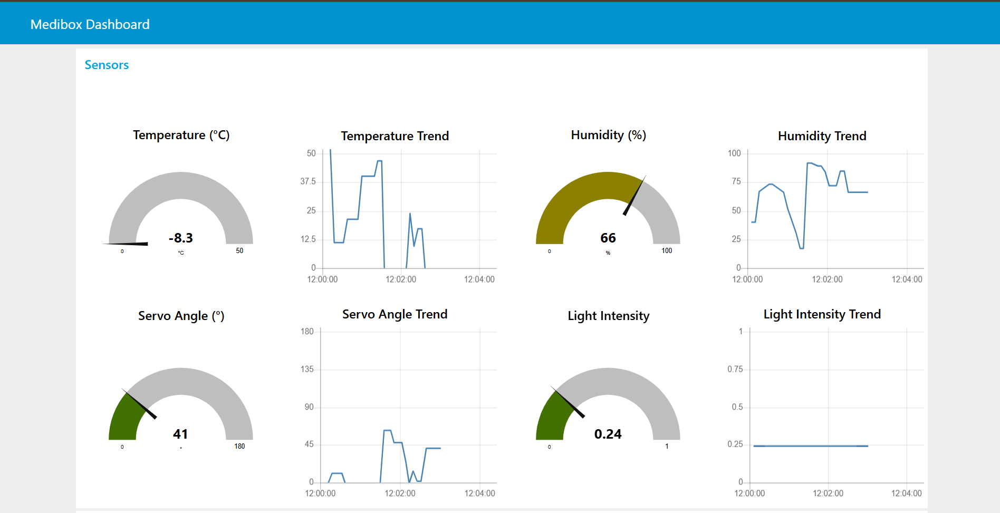
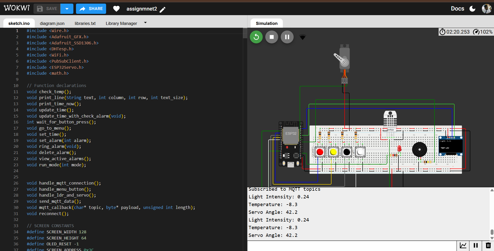
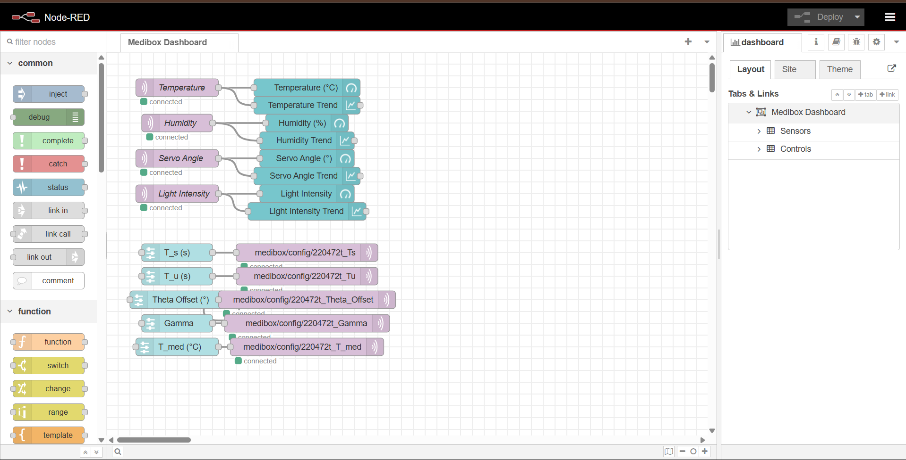

# MediBoX: Smart Medical Box System

**MediBoX** is an IoT-enabled smart medical box built on the ESP32 microcontroller. It monitors environmental conditions, manages alarms for medication reminders, and supports remote configuration via MQTT. The system features an OLED display and push-button interface, making it ideal for elderly or chronic patients to manage their medication with ease. It is fully simulated on [Wokwi](https://wokwi.com/projects/431206882518972417) for easy testing and development.

---

## 🧭 Table of Contents

- [Features](#features)
- [Hardware Requirements](#hardware-requirements)
- [Software Requirements](#software-requirements)
- [Usage](#usage)
- [Screenshots](#screenshots)

---

## 🚀 Features

- **Sensor Monitoring**  
  - LDR (light) and DHT22 (temperature) sensors  
  - Servo adjusts position based on environmental data

- **Alarm System**  
  - Two configurable alarms with buzzer and LED notifications  
  - OK button: snooze (+5 minutes), Cancel button: stop alarm

- **OLED Interface**  
  - SSD1306 128x64 display  
  - Displays time, temperature, and a navigable settings menu

- **MQTT Connectivity**  
  - Publishes light sensor data  
  - Subscribes to config updates via [HiveMQ](https://www.hivemq.com/)

- **Wi-Fi & NTP Support**  
  - Syncs real-time clock via NTP  
  - Works on Wi-Fi-enabled networks

- **Wokwi Simulation**  
  - Full simulation using Wokwi ESP32 emulator for prototyping without hardware

---

## 🛠️ Hardware Requirements

- ESP32 Dev Module  
- LDR (pin 4)  
- DHT22 Sensor (pin 12)  
- Servo Motor (pin 18)  
- SSD1306 OLED Display (I2C – SDA/SCL)  
- Buzzer (pin 5)  
- LED (pin 15)  
- Push Buttons:  
  - OK: pin 32  
  - Cancel: pin 34  
  - Up: pin 33  
  - Down: pin 35  
- Breadboard & Jumper Wires

---

## 💻 Software Requirements

- [Arduino IDE](https://www.arduino.cc/en/software) or [PlatformIO](https://platformio.org/)
- [Wokwi Simulator](https://wokwi.com/projects/431206882518972417)
- [Node-RED](https://nodered.org/) for MQTT dashboard
- HiveMQ MQTT Broker (broker.hivemq.com:1883)

### Required Arduino Libraries

- `WiFi.h` (built-in for ESP32)  
- `ESP32Servo.h`  
- `PubSubClient.h`  
- `DHTesp.h`  
- `Wire.h`  
- `Adafruit_GFX.h`  
- `Adafruit_SSD1306.h`

---

## ▶️ Usage

- **Startup**  
  - ESP32 connects to Wi-Fi  
  - Syncs time via NTP  
  - Sets servo to 30°

- **Monitoring**  
  - Samples light every 5 seconds (configurable)  
  - Samples temperature every 120 seconds  
  - Updates servo position accordingly

- **Alarms**  
  - Triggers at set times (default: 22:05, 22:06)  
  - Buzzer and LED activate  
  - Press **OK** to snooze (+5 min)  
  - Press **Cancel** to stop

- **Menu Navigation (via OLED + Buttons)**  
  - **OK**: Enter menu  
  - **Up/Down**: Navigate options  
    - Set UTC  
    - Set Alarms  
    - Enable/Disable Alarms  
    - View/Delete Alarms  
  - **OK**: Select option  
  - **Cancel**: Exit menu

- **Node-RED Dashboard**  
  - Access at `http://<node-red-ip>:1880/ui`  
  - View real-time sensor data  
  - Remotely configure settings

---

## 🖼️ Screenshots

### 📊 Node-RED Dashboard

Real-time sensor data and configuration controls.

---

### 💡 Wokwi Simulation

ESP32 circuit and code in Wokwi.

---

### 🔁 Node-RED Connections

MQTT flow for data and configuration.

---

